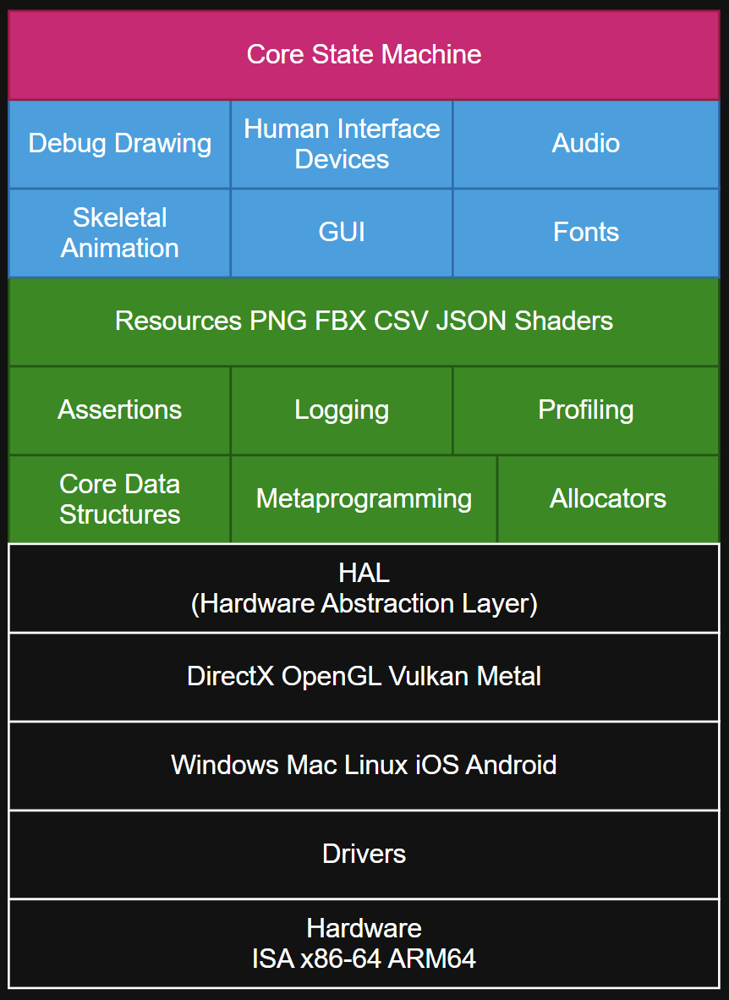
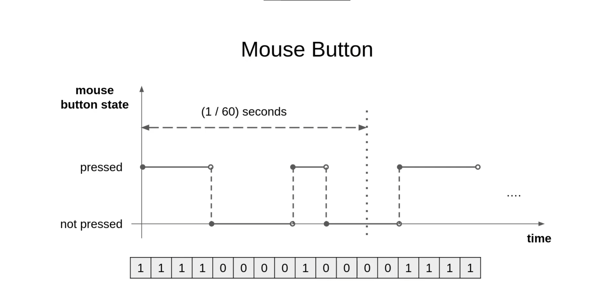

# Demystifying Game Engines
By: Ibrahim El Hindawi

---

Alan Kay: "I made up the term "object-oriented," and I can tell you I did not have C++ in mind."
Dijkstra: "Object-oriented programming is an exceptionally bad idea which could only have originated in California."


---

# Outline
- Game Engine Architecture Overview
- Subsystems: input, update, render, audio, time
- C & Assembly Implementation Details

---

# Why build a Game Engine:
- Unreal Engine has 20 million lines of incomprehensibly complicted C++
- Unity is closed source and uses C#
- DotS/MASS is quite new and experimental
- too fat, too bulky

---

# AAA Game Engine Architecture:

- many generic subsystems
- huge complexity
- many requirements
- likely to have high compile times
- harder to iterate

---

# Game Engine Architecture:

- tiny codebase
- highly specialized
- one target
- super fast compile times
- highly agile

---

# Core Loop
```c
int main() {
    subsystems_initialize_all();
    resource_load_all();
    while (game_is_running) {
        if (!should_wait()) {
            input_read();
            update();
            render();
        } else {
            sleep();
        }
    }
}
```

---

# Core Loop With Framerate
```c
int main() {
    subsystems_initialize_all();
    resource_load_all();
    while (game_is_running) {
        if (!should_wait()) { // check target framerate
            input_read();
            update();
            render();
        } else {
            sleep();
        }
    }
}
```


---

# Input Subsystem

https://www.youtube.com/watch?v=-z8_F9ozERc

---

# Input
```c
void input_read() {
    while (os_get_event()) {
        switch (event) {
            case QUIT: {
                game_is_running = false;
            }
            case KEY_PRESSED: {
                if (vkcode == ESCAPE) {
                    running = false;
                } else if (vkcode == 'W') {
                    player_velocity.x += 1.f;
                } else if (vkcode == 'S') {
                    player_velocity.x -= 1.f;
                } else if (vkcode == 'A') {
                    player_velocity.y += 1.f;
                } else if (vkcode == 'D') {
                    player_velocity.y -= 1.f;
                } else if (vkcode == SPACE) {
                    shoot();
                }
            }
        }
    }
}
```

---

# Update


---

# Render

---

# Some Code:
```x86asm
.data
n qword ?
.code
main proc
 xor rax, rax
 ret
main endp
```
---
