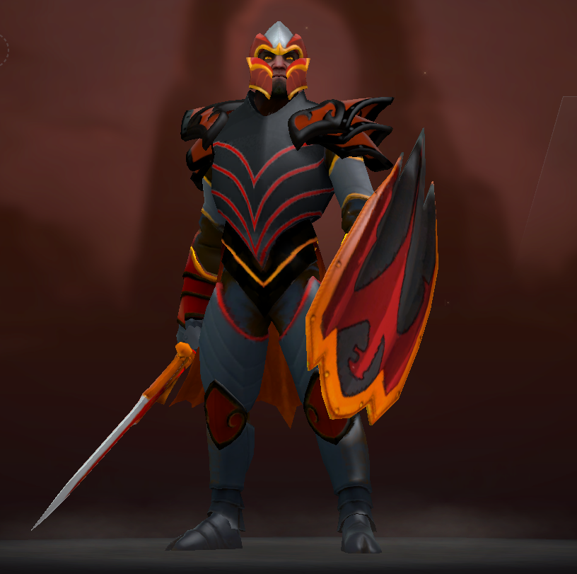

# Demystifying Game Engines
By: Ibrahim El Hindawi

---
# Outline
- Game Engine Architecture Overview
- Subsystems: input, update, render, audio, time
- C & Assembly
---
# Some Code:
```x86asm
.data
n qword ?
.code
main proc
 xor rax, rax
 ret
main endp
```
```python
print('hell, world!')
```
---
# Dragon Knight

Is a cool hero
